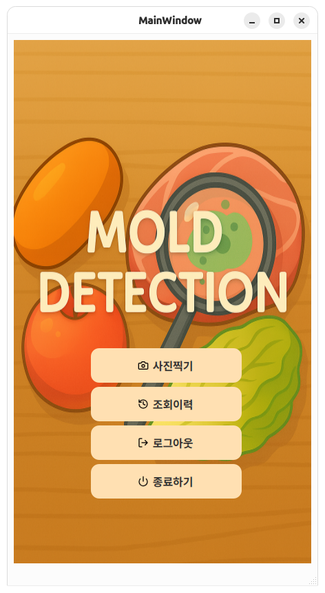
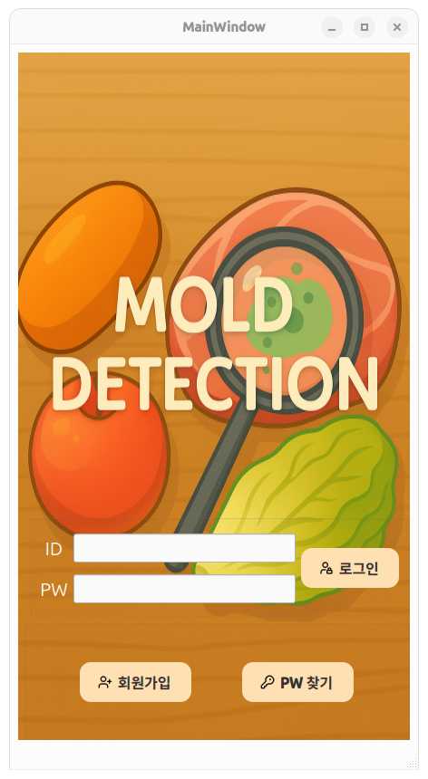
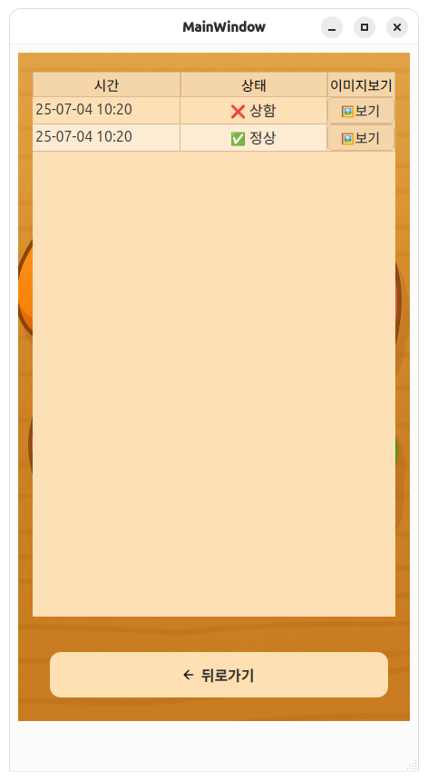
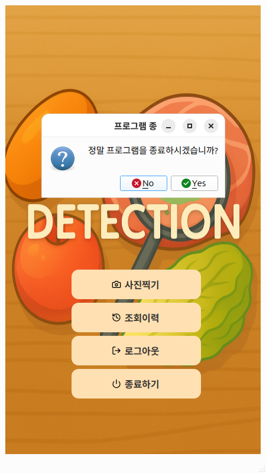
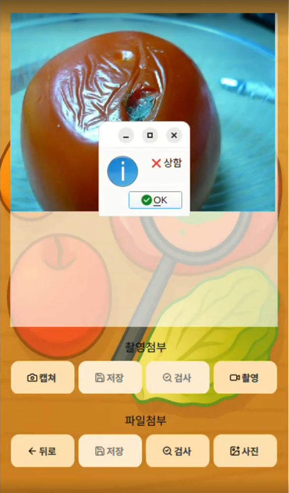

## MOLD DETECTION

**팀원:** 한현희, 하진영, 고준영, 한경식  
**프로젝트:** 음식 사진에서 곰팡이 여부를 판단하는 AI 이미지 분류 시스템  
**진행 기간:** 25년 06월 24일 ~ 25년 07월 07일

---

## 목표
- 사용자가 업로드하거나 촬영한 음식 이미지에서 곰팡이 유무를 자동 분류
- 음식 여부는 YOLO로 판단, 곰팡이 여부는 ResNet 기반 CNN으로 분류
- 검사 결과를 직관적인 UI로 출력하고, 결과 이력을 저장 및 조회

---

## 역할 분담
- **한현희:** 팀장, 서버, 클라이언트 및 DB 구축
- **하진영:** AI모델 구현(Resnet), 모델 학습, 성능 개선, UI
- **고준영:** AI모델 구현(EfficientNet), 모델 학습, 성능 개선
- **한경식:** AI모델 구현(YOLO), 모델 학습, 성능 개선

---

## 기술 스택
- OS: Linux
- Python, C++
- TCP/IP
- PYQT
- MariaDB
- Resnet, YOLO

---

## 주요 기능
- 회원가입 및 로그인 기능
- 음식 이미지에서 음식 여부 판단 (YOLO)
- 곰팡이 여부 분류 (Resnet)
- UI에서 실시간 결과 출력
- 결과 히스토리 저장 및 조회 기능

---

## 겪었던 문제점
- 사전학습 모델에서 오분류 발생
- 과적합으로 검증 정확도 정체
- RESNET50 학습 시 CUDA 메모리 부족
- 실험 결과 기록 부족으로 반복 실험 시 혼란

---

## 문제 해결 방법  
- 모델 구조 재설계 및 선택 유연화  
  - 사전학습 제거 후 Resnet18을 Scratch로 학습  
  - 이후 Resnet50으로 확장하고 FC레이어를 DROPOIT, BATCHNORM으로 커스터마이징  
- 일반화 성능 향상을 위한 조치  
  - 회전, 색상 조정, 스케일 조절 등 이미지 증강 적용  
  - EarlyStopping와 StepLR 스케줄러로 과적합 방지  
- 학습 환경 최적화  
  - Batch size를 32 -> 4로 줄이고 torch. backends. cudnn. benchmark = True 설정추가  
  - GPU캐시 메모리 수시 정리로 메모리 효율 확보  
- 실험 재현성 확보  
  - 학습 로그 및 모델 자동 저장 기능 추가  
  - loss/accuracy 그래프 시각화 및 epoch별 성능 정리  

---

## 폴더 구조
mold-detection/  
├── 📁 UI/ # 클라이언트 UI 화면 이미지  
├── 📁 final0707/                  # 메인 클라이언트 프로젝트 디렉토리  
│   ├── mainwindow.py              # PySide6 기반 메인 UI 코드  
│   ├── socket_client.py           # TCP 클라이언트 코드  
│   ├── ui_form.py                 # UI 구성 로직  
│   ├── form.ui                    # Qt Designer로 만든 UI 파일  
│   ├── requirements.txt           # 의존 패키지 목록  
│   ├── RESN0701.pth               # 학습된 ResNet 모델  
│   ├── YOLO0707.pt                # 학습된 YOLO 모델  
│   ├── img.qrc                    # 리소스 이미지 등록 파일  
│   ├── FRESH.png                  # UI 배경 이미지  
│   └── 📁 images/                 # UI용 아이콘/버튼 이미지 모음  
│       ├── addr.png  
│       └── ...  
│  
├── 📁 server0707/                  # C++ 기반 TCP 서버 디렉토리  
│   ├── cJSON.c                     # JSON 파싱 및 생성 관련 함수 정의 (라이브러리)  
│   ├── cJSON.h                     # JSON 라이브러리 헤더 파일  
│   └── fresh_server.cpp            # 메인 TCP 서버 코드 (클라이언트 요청 수신, DB 연동 포함)  
  
├── README.md  
  
├── 📄 resnet50_0703.py             # ResNet 모델 정의 및 학습 코드  

---

## 🖼️ 실행 결과

### Main User Interface

### Login Page

### Register Page

### History Page

### Logout State

### Mold Detection Result

### Not Food Detection Result

